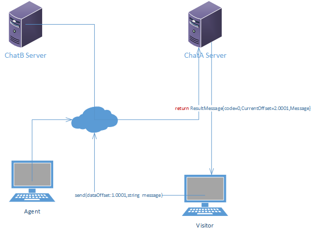
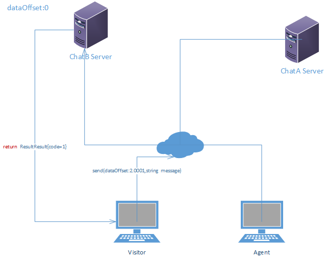

# chat server 数据重建

## 现有状况

...
## 设计目标

chatserver服务器发生切换的时候，通过agent和visitor的本地数据对chatserver切换的服务器进行聊天数据的重建，确保聊天连续性和数据完整性

## 总体思路
 
Visitor和agent 向chatserver 发送信息的时候，将传入一个dataOffset 数据偏移量参数（一个记录了聊天记录版本信息的值，调用发送信息接口的返回值，新聊天默认传0）发送到chatserver：
1.如果该dataOffset 小于或者等于chatserver 的dataOffset，chat server 接收到新的信息以后
     将递增chatserver本地的dataOffset的值并且将最新的未读聊天信息和更新后的dataoffset返回给visitor,visitor获取返回值以后，对本地聊天记录进行更新，并且更新dataOffset。
2.如果visitor的dataOffset 大于chatserver的dataOffset, chatserver 将直接返回ReturnResult 结果告知visitor 端，需要将最新的聊天记录同步到chatserver.


##  场景

###  正常场景

  

     Visitor 和Agent 通过服务器chatA server 聊天，visitor 通过sendMessage接口 将本地的数据偏移量dataOffset 和聊天信息传到chat server ，chat server 接收到新的信息以后
     将更新以后的dataOffset和最新的聊天信息返回给visitor,visitor获取返回值以后，对本地信息进行更新，并且更新dataOffset。
 

###  切换后场景


 

   服务器发生切换后以后visitor再给chatserver发送信息，这个时候，消息将发送到chatB server :
   1.chatb server 判断是否存在该聊天，如果不存在就返回ReturnResult{code=1,CurrentOffset=-1} 给visitor端，告诉visitor端进行数据重建，currentOffset=-1表示 数据从头开始重建。
   2.如果聊天存在的话，判断chat server本地的dataOffset 值是否小于visitor的dataOffset值，是：返回结果告知chatserver 进行数据重建，否：更新chatserver 的dataOffset 的值，并将最新未读聊天记录返回给visitor端。


     if(!exists(chatId)) return ReturnResult{code=1,CurrentOffset=-1};
     if(chatserver.dataOffset < visitor.dataOffset)
     {
       //返回ReturnResult{code=1,CurrentOffset=-1}
    }
     else
       {
         //update chatserver.dataoffset
         //returnResult{code=0,CurrentOffset=XXX,Message=xxxx}
       }


## ChatServer 内部数据结构 

   
### Message
1.  访客信息
   ```c#
  public class Visitor
  {
    public object Id{get;set;}
    public string Name{get;set;}
    public string Email{get;set;}
    ...

  }
  ```
2.  坐席信息
   ```c#
  public class Agent
  {
    public object Id{get;set;}
    public string Name{get;set;}

  }
  ```

3.  聊天记录
   ```c#
   public class Message {
    public long Id{get;set;}
    public string Content{get;set;}
    public DateTime  SendTime{get;set;}
    ...
   }
 
  ```
4.  聊天
   ```c#
   public class Chat {
    private int visitorOffset=1;
    private double agentOffset=0.0001;
    private SortedList<double,Message> ChatMessages{get;set;}
 
    public object Id{get;set;}
    public Visitor Visitor{get;set;}
   
    public double DataOffset{get{return visitor+agentOffset;};}
    public DateTime BeginTime{get;set;}
    ...
    public int AddVisitorMessage(Message message)
    {
        visitorOffset+=1;
        ChatMessages.Add(DataOffset,message);
        ...
        return DataOffset;
    }
    public int AddAgentMessage(int agentId,Message message)
    {
        agentOffset+=0.0001
        ChatMessages.Add(DataOffset,message);
        ...
        return DataOffset;
    }
    public  SortedList<int,Message> GetAllMessage();
    public SortedList<int,Message> GetNewMessage(long dataOffset);

   }
   ```
   Visitor和agent的offset 分开记录分别为visitorOffset和agentOffset,visitor的偏移量visitorOffset从1开始递增，每次递增1; agent的偏移量agentOffset从0.0001开始递增，每次递增0.0001.


##  Chatserver API Data Struct

  ### ReturnResult

  ```c#
     publc class ReturnResult
     {
          public int Code{get;set;} //0 success,-1 error ,1 data rebuild
          public double CurrentOffset{get;set;}
          public SortedList<double,ChatMessage> Messages{get;set;}
          ...
     }

```
### ChatMessage
  ```c#
     publc class ChatMessage
     {
          public object Id{get;set;}
          public double DataOffset{get;set;}
          public string Content{get;set;}
          public DateTime SendTime{get;set;}
          ...
     }
```


## Visitor & Agent 数据结构

   ```js
  Chat
  {
    var Id;
    var currentOffset;
     var Messages = [DataOffset:
        '{ Id: 'xxx', Content: 'xxx', SendTime...}'
        // ...
      ];
    ...
  }
 

 ```


 